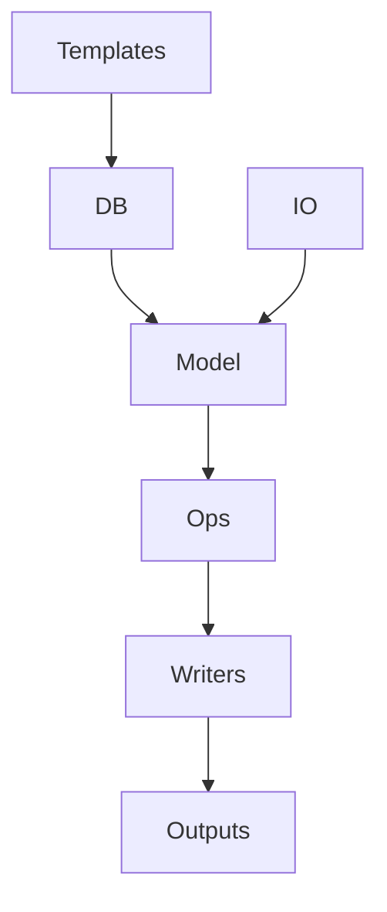
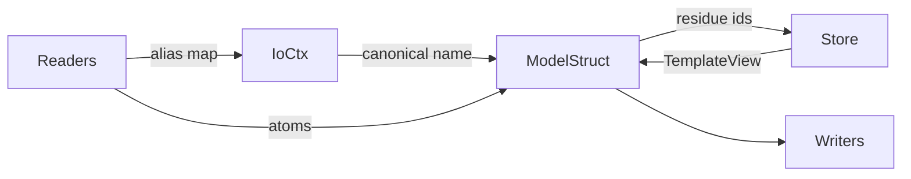
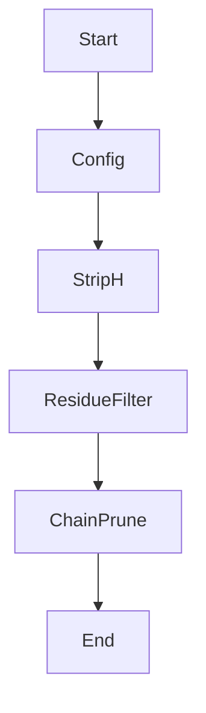
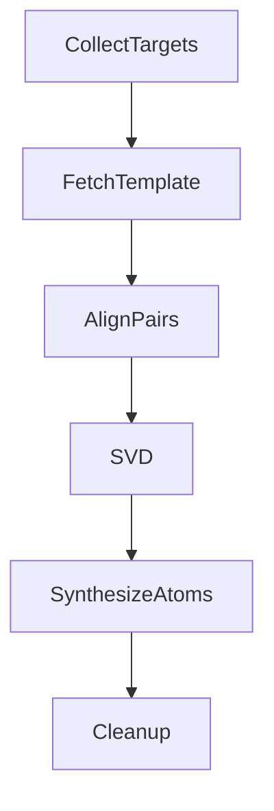
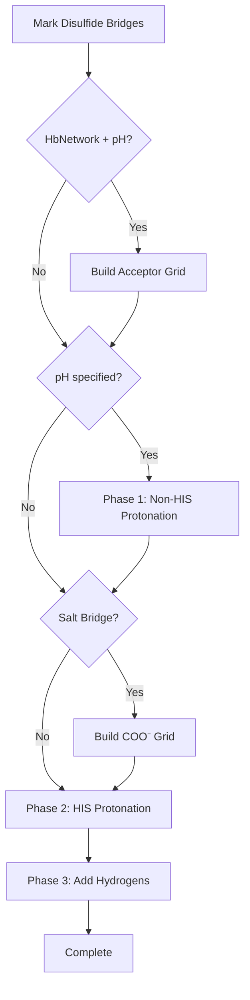
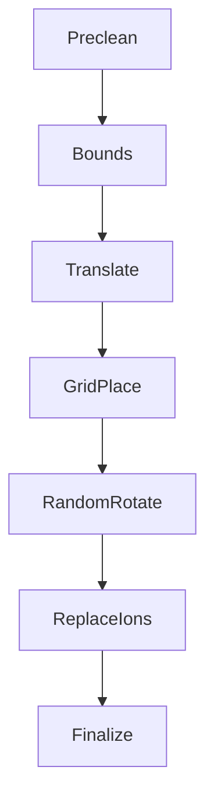
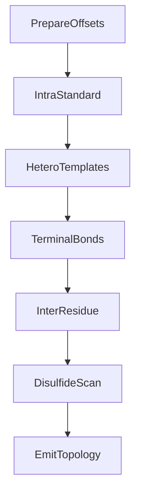
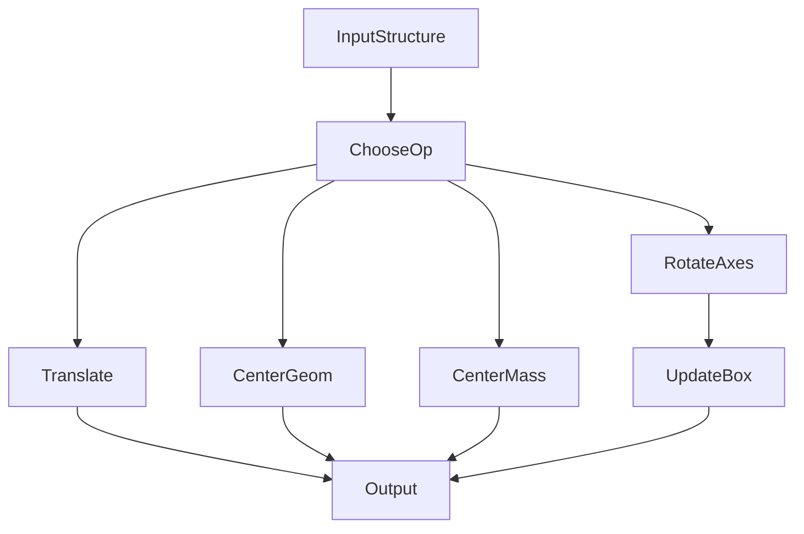

# BioForge Architecture

## 1. System Overview

BioForge is organized around five cooperating domains: data templates (`templates/` and `db`), structural models (`model`), IO codecs (`io`), molecular operations (`ops`), and public exports (`lib.rs`). Templates encode chemically faithful residue definitions, IO modules translate external files into internal structures, and ops mutate those structures into simulation-ready systems.

- **Templates** – Static TOML descriptors for every supported residue or solvent species.
- **DB** – The template loader/store that exposes `TemplateView` references to the rest of the crate.
- **IO** – Parsers and serializers (PDB, mmCIF, MOL2) that hydrate or persist `Structure` instances.
- **Model** – Neutral data classes (`Atom`, `Residue`, `Chain`, `Structure`, `Topology`) shared across modules.
- **Ops** – Transformation pipelines that clean, repair, protonate, solvate, and connect structures.
- **Writers** – Emitters that translate the final structure/topology back to biochemical formats.

## 2. IO and Data Modules

The IO and data layers orchestrate template lookup, alias resolution, and structure instantiation before ops run.

- **Readers** – Streaming parsers (`io::pdb::reader`, `io::mmcif::reader`, `io::mol2::reader`) that emit `Structure` or `Template` values.
- **IoCtx** – `IoContext` maps aliases to canonical residue names and standard enums for consistent categorization.
- **ModelStruct** – Instances of `Structure`, `Chain`, and `Residue` that accumulate atomic data and metadata.
- **Store** – Singleton `db::store::DataStore` holding every pre-parsed template accessible via `TemplateView`.
- **Writers** – Formatters that consume `Structure`/`Topology` pairs to write PDB or mmCIF output.

## 3. Ops Pipelines

Each ops submodule follows a focused pipeline. Flowcharts capture the order of decisions and mutations.

### 3.1 Clean Pipeline (`ops::clean`)

- **Start** – Receives a mutable `Structure` plus `CleanConfig` options.
- **Config** – Interprets flags (water-only, ion removal, name allow/deny lists).
- **StripH** – Optionally removes hydrogen atoms residue-by-residue.
- **ResidueFilter** – Retains or drops residues based on category, standard name, and explicit keep/remove sets.
- **ChainPrune** – Prunes chains emptied by prior filtering to keep the structure minimal.
- **End** – Yields a cleaned structure ready for downstream repair.

### 3.2 Repair Pipeline (`ops::repair`)

- **CollectTargets** – Iterates standard residues to identify those eligible for repair.
- **FetchTemplate** – Pulls `TemplateView` for each residue name, failing early if missing.
- **AlignPairs** – Pairs existing heavy atoms with template coordinates for alignment anchors.
- **SVD** – Computes rotation/translation via Kabsch/SVD, handling single/dual point fallbacks.
- **SynthesizeAtoms** – Recreates missing heavy atoms (terminal OXT for peptides, OP3 for 5'-phosphorylated nucleic acids) using transformed template positions or tetrahedral geometry.
- **Cleanup** – Removes atoms not present in the template to ensure canonical composition.

### 3.3 Hydro Pipeline (`ops::hydro`)

- **Disulfide Detection** – Identifies CYS pairs forming S-S bonds (distance < 2.2Å) and relabels them to `CYX` to prevent thiol hydrogenation.
- **Acceptor Grid** (Conditional) – Built only when `HisStrategy::HbNetwork` is used AND `target_ph` is specified. Contains all N/O/F atoms for H-bond scoring.
- **Phase 1: Non-HIS Protonation** (Conditional) – Skipped entirely when `target_ph` is `None`. Applies pKa-based titration rules to titratable residues (ASP, GLU, LYS, ARG, CYS, TYR) in parallel. Preserves user-specified names when no pH is given.
- **COO⁻ Grid Construction** (Conditional) – Built only when `his_salt_bridge_protonation` is enabled. Contains carboxylate oxygen atoms from:
  - ASP⁻ (deprotonated aspartate): OD1, OD2
  - GLU⁻ (deprotonated glutamate): OE1, OE2
  - C-terminal COO⁻ (when pH ≥ 3.1): O, OXT
- **Phase 2: HIS Protonation** – Determines histidine protonation state via priority logic:
  - **Priority 1**: pH < 6.0 → HIP (acidic conditions)
  - **Priority 2**: No pH AND no salt bridge → preserve user name
  - **Priority 3**: Salt bridge detected (ND1 or NE2 within 4.0Å of COO⁻) → HIP
  - **Priority 4**: No pH → preserve user name (salt bridge didn't trigger)
  - **Priority 5**: Apply HisStrategy (DirectHID/DirectHIE/Random/HbNetwork)
- **Phase 3: Hydrogen Addition** – Adds hydrogen atoms to all residues based on their final protonation states. Reconstructs geometry using template anchors and Kabsch alignment. Handles terminal-specific hydrogens:
  - **N-terminal**: H1/H2/H3 (protonated) or H1/H2 (deprotonated, pH > 8.0)
  - **C-terminal**: HOXT (protonated, pH < 3.1) or no HOXT (deprotonated)
  - **5'-terminal nucleic**: HO5' (no phosphate) or HOP3 (phosphate + pH < 6.5)
  - **3'-terminal nucleic**: HO3'

### 3.4 Solvate Pipeline (`ops::solvate`)

- **Preclean** – Optionally removes existing solvent/ions before new placement.
- **Bounds** – Computes bounding box and box vectors with configured margins.
- **Translate** – Recenters solute so the solvent box origin is at margin offsets.
- **GridPlace** – Populates a 3D lattice with HOH templates, skipping clashes via `Grid` checks.
- **RandomRotate** – Orients each water copy with random Euler rotations for diversity.
- **ReplaceIons** – Swaps selected waters with ions until the target charge is met, using RNG for distribution and reporting failure if insufficient.
- **Finalize** – Appends the solvent chain and updates the structure's periodic box.

### 3.5 Topology Builder (`ops::topology`)

- **PrepareOffsets** – Computes atom-index offsets for every residue to map local indexes to global topology indexes.
- **IntraStandard** – Connects intra-residue bonds per template definitions, including hydrogen anchors.
- **HeteroTemplates** – Injects bonds for hetero residues via user-provided `Template`s or errors if absent.
- **TerminalBonds** – Adds special-case bonds for terminal atoms (H1/H2/H3, HOXT for peptides; P–OP3, OP3–HOP3, O5'–HO5', O3'–HO3' for nucleic acids).
- **InterResidue** – Detects peptide and nucleic linkages by measuring atom distances against cutoffs.
- **DisulfideScan** – Adds bonds between cystine sulfurs within the disulfide cutoff.
- **EmitTopology** – Produces the final `Topology` pairing the structure with collected bonds.

### 3.6 Transform Utilities (`ops::transform`)

- **InputStructure** – Mutable structure reference supplied by callers.
- **ChooseOp** – Selects translation, geometric centering, mass centering, or Euler-based rotations.
- **Translate / CenterGeom / CenterMass** – Adjust atomic coordinates directly, reusing vector math utilities.
- **RotateAxes** – Applies axis or Euler rotations via `Rotation3`.
- **UpdateBox** – Rotates the periodic box vectors to remain aligned with atom coordinates.
- **Output** – Returns the transformed structure for subsequent ops or IO.

## 4. Algorithm Deep Dives

### 4.1 Template Alignment via SVD

- **Data selection** – `repair::calculate_transform` collects matched atom pairs between the residue and template; if only one or two matches exist, it falls back to translation-only or single-axis rotation.
- **Covariance build** – subtracts centroids and accumulates a 3×3 covariance matrix representing the correlation between residue and template frames.
- **SVD / Kabsch** – decomposes the covariance matrix with nalgebra’s SVD; determinant checks ensure right-handed rotations by flipping the final row when necessary.
- **Translation synthesis** – multiplies the template centroid by the rotation and subtracts from the residue centroid to obtain the translation vector.
- **Degradation path** – When the template lacks enough anchors, the algorithm returns an alignment error so the caller can report `AlignmentFailed` rather than emitting a distorted residue.

### 4.2 Hydrogen Reconstruction Geometry

- **Anchor selection** – Each template hydrogen lists one or more anchor atoms; missing anchors trigger `IncompleteResidueForHydro` errors to avoid guesswork.
- **Rigid transform** – `reconstruct_geometry` retrieves the residue-specific transform (rotation + translation) derived from current heavy atoms and applies it to the template hydrogen coordinate.
- **Randomization** – None is applied for standard hydrogens, ensuring deterministic placement; terminals use evenly spaced tetrahedral vectors sorted by dot product to preserve orientation.
- **Terminal logic** – N-termini place up to three hydrogens arranged around the N–CA axis; C-termini add HOXT to OXT; nucleic 5'-terminals either add HO5' (no phosphate) or pH-dependent HOP3 (with phosphate, below pKₐ₂ ≈ 6.5); nucleic 3'-terminals always add HO3'.

### 4.3 Ion Replacement and Degradation Handling

- **Charge tracking** – `replace_with_ions` computes the total solute charge by summing template charges, accounting for keep ions, then compares against the requested total.
- **Candidate selection** – Water residue IDs are shuffled and used as replacement slots; each swap decreases the charge delta by the ion's charge.
- **Failure detection** – If the list depletes before the delta reaches zero, the function returns `IonizationFailed` (with details) or `BoxTooSmall` when no solvent exists, preventing silent mismatch.
- **Random fairness** – RNG with optional seed ensures reproducibility for tests or deterministic setups.

### 4.4 Topology Inference and Fallbacks

- **Template-driven bonds** – Intra-residue connectivity is strictly template-backed; missing atoms raise `TopologyAtomMissing` unless the name is an optional terminal hydrogen.
- **Distance-based linkages** – Peptide and nucleic linkages measure squared distances before adding bonds, so chains lacking adjacent residues simply skip the step.
- **Disulfide detection** – Sulfurs closer than `disulfide_bond_cutoff` are connected; raising the cutoff enables permissive bonding while still preventing unrealistic links.
- **Hetero template injection** – User-supplied `Template`s cover ligands; omission surfaces `MissingHeteroTemplate` to encourage explicit topology definitions.

### 4.5 Error Propagation Strategy

- **thiserror-based enums** – `io::error::Error` and `ops::error::Error` capture precise failure contexts (source format, residue name, line numbers).
- **Eager validation** – Template loading panics on duplicate names or malformed TOML via `include_str!`, guaranteeing consistent runtime data.
- **Graceful exits** – When hydrogens or alignments cannot be reconstructed, the caller receives descriptive errors rather than partial mutations, enabling upstream retry or user messaging.
