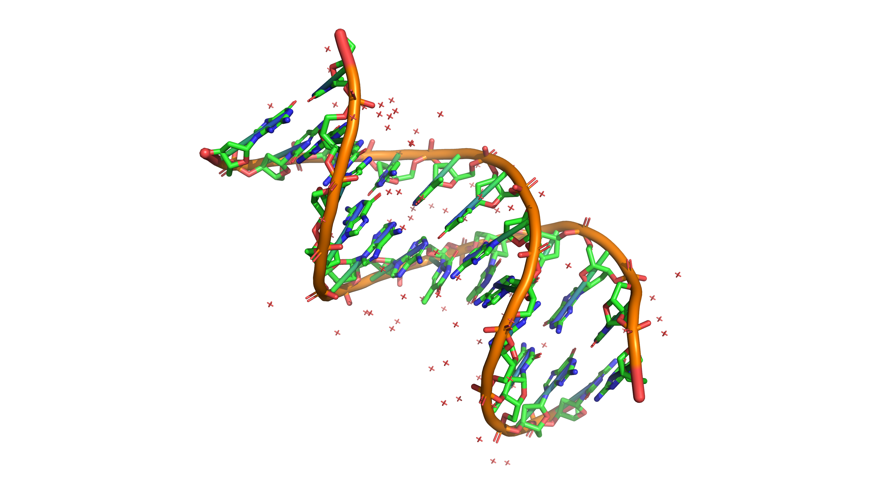
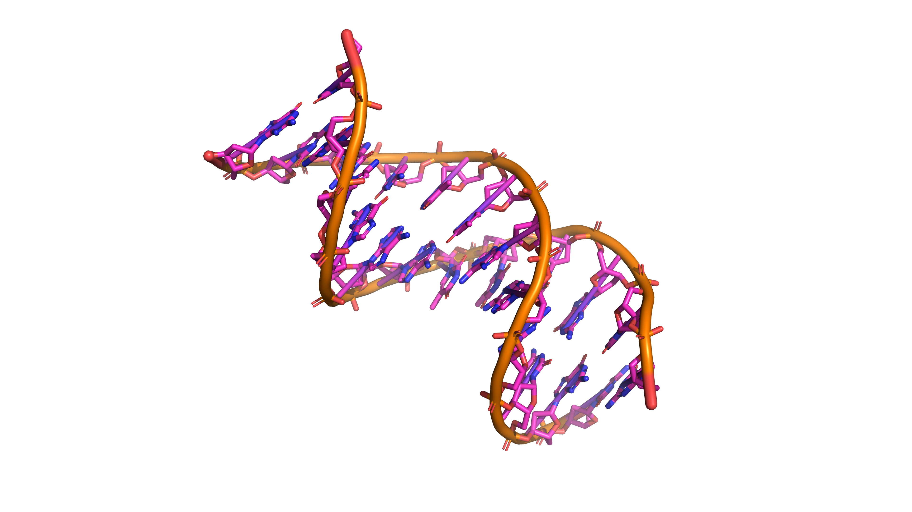
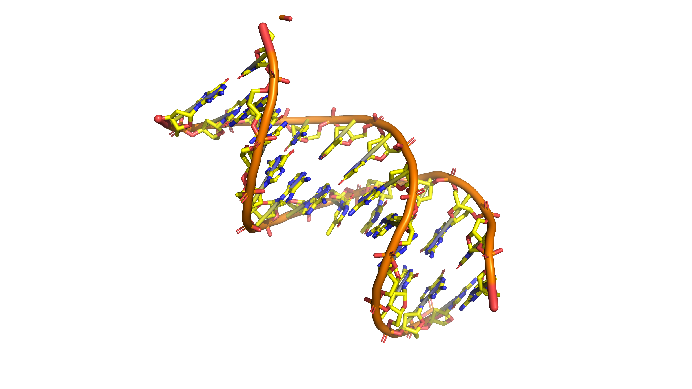
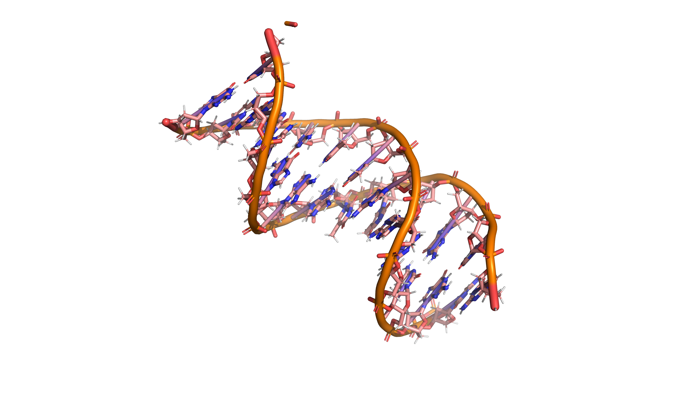

# Streaming Pipeline Example (with Shell Pipes)

## Inputs

- **Structure**: `1BNA.pdb` — canonical B-DNA dodecamer coordinates.

## Pipeline Stages

| Step | Description                                                   | Preview                            |
| ---- | ------------------------------------------------------------- | ---------------------------------- |
| 1    | Raw input before cleanup.                                     |      |
| 2    | `clean` removes crystallographic water/ions (when requested). |      |
| 3    | `repair` rebuilds missing atoms using templates.              |    |
| 4    | `hydro` adds hydrogens at the chosen pH.                      |      |
| 5    | `solvate` packs the structure in a solvent box with ions.     |  |

## Command

Because each CLI subcommand emits structured data to stdout (when `-o` is omitted) the entire workflow can stream through Unix pipes:

```bash
bioforge clean -i 1BNA.pdb --water --ions \
| bioforge repair --format pdb --out-format pdb \
| bioforge hydro --ph 7.45 \
| bioforge transform --center-mass --rotate-x 45 \
| bioforge solvate --margin 15 --neutralize \
> 1BNA-prepared.pdb
```

## Results

- Produces a fully prepared structure after cleaning, repairing, protonating, transforming, and solvating in one pass.
- Streams the final coordinates directly to `1BNA-prepared.pdb`.
